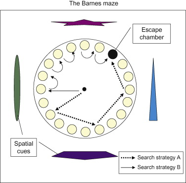
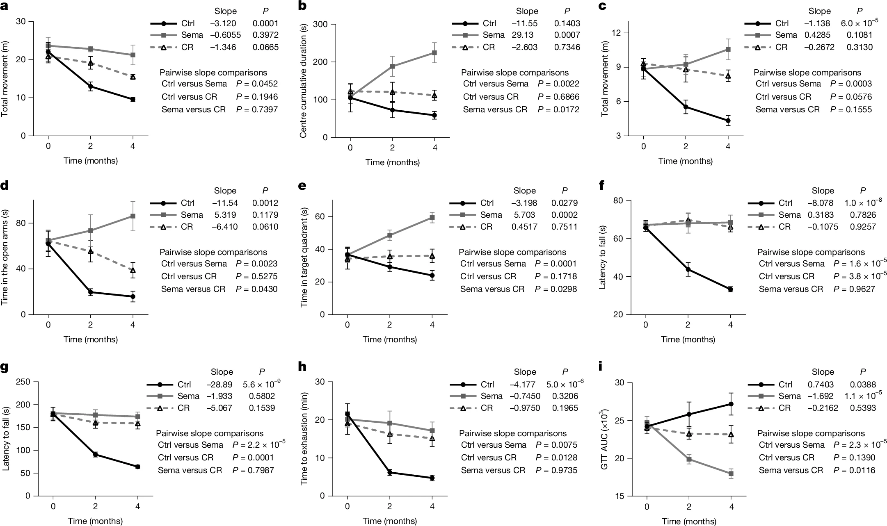

```{r}
#| label: load-packages
#| include: false
library(tidyverse)
library(ggthemes)
library(ggplot2)
library(randomcoloR)
library(lmerTest)
library(patchwork)
library(emmeans)
library(r2glmm)
library(performance)
```
```{r}
#| echo: false

default_chunk_hook  <- knitr::knit_hooks$get("chunk")

latex_font_size <- c("Huge", "huge", "LARGE", "Large", 
                     "large", "normalsize", "small", 
                     "footnotesize", "scriptsize", "tiny")

knitr::knit_hooks$set(chunk = function(x, options) {
  x <- default_chunk_hook(x, options)
  if(options$size %in% latex_font_size) {
    paste0("\n \\", options$size, "\n\n", 
      x, 
      "\n\n \\normalsize"
    )
  } else {
    x
  }
})

```

# Background

## Understanding the Technique

Linear mixed effects regression builds upon standard linear regression that assumes each observation/data point is independent. When we measure the same subject under different conditions, obviously those measurements are not independent. However, this can be addressed with a few changes. Instead of ignoring that we've repeated measurements on the same subject, they are built into the model. If we simply treated subject as a fixed effect, when the levels of the fixed effect are expanded into binary coefficients (subject = 1, subject = 2, ...), that would add $n-1$ new variables, rapidly inflating dimensionality. To prevent that, each subject is given its own regression model with a unique intercept: 

\begin{align*}
   Y_{ij} &= (\underbrace{\gamma_{0i}}_{\textrm{rand. int.}} +  \beta_0) + \beta_1 x_{1ij} + \beta_2 x_{2ij} + \cdots + \beta_{p-1} x_{(p-1)ij} + \epsilon_{ij},
\end{align*}
where:

 * $i=1, 2, ..., n$ is the index for the subjects 
 * $j=1, 2, ..., n_i$ is the index for the observation on subject $i$. 

## Finding a Study

```{=html}
<iframe width="100%" height="200px" src="https://pubmed.ncbi.nlm.nih.gov/42686906/" title="Journal Article"></iframe>
```

Because the journal Nature requires data availability in recently published papers, that allows for a large variety in available data sets for use in this portfolio. Especially appreciated is authors who provide their data directly instead of requiring the corresponding author to reply to an email... but anyways. 

Searching through recently published articles with search terms like, "mixed effects", "repeated measures", "regression", etc., I found a recently published article titled "Late-life semaglutide treatment slows ageing and extends lifespan in female mice." After looking through the methods and seeing multiple mentions of the use of linear mixed-effects models, I felt this paper would work for an attempt at reproduction [@Feng2026].

## Goal of the Study

Increasing amounts of research has been published on medications known as 'GLP-1' drugs, which stands for 'glucagon-like-peptide-1.'

```{r}
#| echo: false
#| label: fig-glp_time
#| fig-cap: "Trend of Published Research on 'GLP-1'"
#| fig-width: 6
#| fig-height: 4

glp1 <- read_csv('GLP1.csv')

ggplot(data = glp1, aes(x = Year, y = Count)) + 
  geom_col() + 
  ylab("Articles Published") +
  theme_clean()

```


 Put simply, these drugs mimic the afforementioned GLP-1 hormone produced in the human body that serves to regulate appetite and lower the risk of over-eating. Initially created as a drug for those with Type II diabetes, the broader effects on reducing obesity have made them one of the most important drugs developed in decades. The most well known of these drugs is known commercially as 'Ozempic' and scientifically as semaglutide [@williamsGLP1].

 {width=40%}

The journal article by Feng et al. looks to investigate potential benefits of semaglutide beyond obesity, such as alleviating the effects of aging. It's been shown that a reduction in excess calories extends lifespan in humans and other animals. Do GLP-1 drugs help with aging in the same way as a diet with restricted calories, or do they work in different ways? This article looks at measures of aging among mice in three groups: 

|Control | Calorie Restricted Diet | Semaglutide Treatment|
|:--     |:--:         |:--:|  
|n = 10    | n = 10   | n = 10|


 Calorie Restricted mice were given controlled portions of food, while the control and semaglutide mice had unlimited food. 


 {width=40%}


 While the study uses several different measures of aging, I'm going to focus on the performance of the mice in the Barnes Maze. The Barnes Maze is a test used on mice and rats that tests their ability to recognize previous visual cues [@barnes]. When tested, they see how long the mouse stays in the quadrant it's been conditioned to remember as the exit (the longer time the better the memory). As the measure used is time (continuous), there should be no problems modelling it with a linear mixed-effects model. 

{width=40%}

## Goal of Statistical Analysis

The goal of their analysis with the Barnes Maze test is to see if the slopes of the treatments are different with respect to time. 

The basic model of their regression is as follows: 

\begin{align*}
   t_{ij} &= (\underbrace{\gamma_{0i}}_{\textrm{random intercept}} + \beta_0) + \beta_1(x_{1ij})I(x_{2ij} = \text{"Calorie Restricted Diet"}) + \\ 
   & \beta_2(x_{1ij})I(x_{3ij} = \text{"Semaglutide"}) + \epsilon_{ij}
\end{align*}
where:

- $t$ is the time each mouse spends in the correct quadrant
- $i=1, 2, ..., n$ is the index for each mouse
- $j=1, 2, ..., n_i$ is the index for the observation on mouse $i$. 
- $\gamma$ is the random intercept for the time each mouse takes to complete the maze
- $\beta_0$ is the intercept which includes the slope of time for mice in the "Control" treatment
- $\beta_1$ is the slope of time for mice in the "Calorie Restricted" treatment
- $\beta_2$ is the slope of time for mice in the "Semaglutide" treatment
- $\epsilon$ is the conditional residual

# Reproduction of the Study
## Data Cleaning

Here's the cleaning I did to the original data file available for download in the paper [@tidyverse]: 

```{r}
#| eval: false


dat <- read_csv('mice.csv')
dat <- dat[1:3,]

dat <- data.frame(t(dat))
colnames(dat) <- dat[1,]
dat <- dat[-1,]
dat$subject <- 1:30
dat$treatment <- rep(c("Control", "Sema", "CR"), each = 10)
rownames(dat) <- NULL
dat <- dat |>
  pivot_longer(cols = c("0 month", "2 month", "4 month"), 
               names_to = "months", 
               values_to = "time")
dat$months <- rep(c(0,2,4), 30)

write_csv(dat, 'mice.csv')
```

## Data Summary

First, let's look at the raw data [@ggplot2], [@random], [@ggthemes]:

```{r}
#| echo: false
#| label: fig-raw
#| fig-cap: "Maze Time Across Treatments and Mouse"
#| fig-width: 6
#| fig-height: 4


dat <- read_csv('mice.csv')

dat$subject <- factor(dat$subject, levels = unique(dat$subject))

set.seed(13)

colors_ctrl <- distinctColorPalette(10)
colors_CR <- distinctColorPalette(10)
colors_SEMA <- distinctColorPalette(10)

all_colors <- c(colors_ctrl, colors_CR, colors_SEMA)

names(all_colors) <- levels(dat$subject)

ggplot(data = dat, aes(x = months, y = time, color = subject)) + 
  facet_wrap(vars(treatment)) + 
  geom_point() + 
  geom_line() + 
  theme_clean() + 
  theme(legend.position = "none") + 
  scale_x_continuous(breaks = c(0,2,4)) + 
  ylab('Time(s)') + 
  xlab('Months') + 
  scale_color_manual(values = all_colors)

```

A little messy, but there's a clear decline in time in the control group that's not as present in the calorie restricted or semaglutide groups. 

What if we summarize this and take the individual out of it?

```{r}
#| echo: false
#| label: fig-summary
#| fig-cap: "Maze Time Across Treatments"
#| fig-width: 6
#| fig-height: 4


ggplot(data = dat, aes(x = as.character(months), y = time, fill = treatment)) + 
  geom_boxplot(position = position_dodge(width = 0.85)) + 
  xlab("Months") +
  ylab("Time(s)") + 
  theme_clean() +
  labs(fill = "Treatment")


```


In this view, the differences in time across diet appear to widen as time goes on. 

## Model Assumptions

Let's check if our model fits the assumptions of linear mixed-effects regression [@lmerTest], [@patchwork]. 

### Normality of Conditional Residuals

```{r}
#| echo: false
#| label: fig-conditional_residuals
#| fig-cap: "Model Conditional Residuals"
#| fig-width: 6
#| fig-height: 4

mod <- lmer(time ~ months*treatment + (1|subject), data = dat)

conditional_residuals <- resid(mod)

p.hist <- ggplot(data=tibble(r=conditional_residuals))+
  geom_histogram(aes(x=r, y=after_stat(density)),
  color="lightgrey",
  breaks=seq(-40, 40, length.out=10))+
    geom_hline(yintercept=0)+
    theme_bw() +
    xlab("Conditional Residuals")+
    ylab("Density")

p.qq <- ggplot(data=tibble(r=conditional_residuals)) +
stat_qq(aes(sample=r)) +
stat_qq_line(aes(sample=r))+
theme_bw() +
coord_flip() +
ylab("Conditional Residuals")+
xlab("Theoretical Quantile")


p.hist + p.qq

```

When looking for normality, we check that a histogram is centered around 0 and appears roughly gaussian shaped, and that our points fit relatively closely to a qqplot of the normal distribution. In the case of our model, our conditional residuals are centered around 0 and do appear to be roughly gaussian shaped, with the distribution weighted slightly towards negative residuals. The qq-plot shows a close fit to a theoretical distribution. And while not necessarily the best test of approximate normality, a Shapiro-Wilk test for normality shows no statistically discernible deviation from normality ($p = 0.41$)

### Multivariate Normality of Marginal Residuals

```{r}
#| echo: false
#| label: fig-marginal_residuals
#| fig-cap: "Model Marginal Residuals"
#| fig-width: 6
#| fig-height: 4


dat <- dat |>
  mutate(y.hat = model.matrix(mod) %*% fixef(mod)) |> 
  mutate(r.marginal = time - y.hat)

Sigma.gamma <- as.matrix(VarCorr(mod)$subject) # estimated covariance

subjects <- unique(dat$subject)

dat.mem <- tibble(subject = subjects,
                         MD = NA)

for(i in 1:length(subjects)){
# Subject to check
curr.subject <- subjects[i]
curr.dat <- dat %>% filter(subject == curr.subject)
curr.n <- nrow(curr.dat)
# Bulid Covariance Matrix
var.r <- sigma(mod)^2 # estimated conditional error variance
Zi <- rep(1, nrow(curr.dat))
Sigma.epsilon.i <- Zi %*% Sigma.gamma %*% t(Zi) + diag(var.r, nrow(curr.dat))
# Compute Distance
dat.mem$MD[i] = t(curr.dat$r.marginal) %*% solve(Sigma.epsilon.i) %*% curr.dat$r.marginal
}


ggplot(data = dat.mem) + 
  stat_qq(aes(sample=MD),
  distribution = qchisq, dparams = (list(df=3))) +
    stat_qq_line(aes(sample=MD),
    distribution = qchisq, dparams = (list(df=3)))+
      theme_bw() +
      coord_flip() +
      ylab("Mahalanobis Distance")+
      xlab("Theoretical Quantile")


```

A qq-plot of our Mahalanobis distances show that the marginal residuals fit well with a multivariate normal distribution. 

### Normality of Random Intercepts

Likely due to small sample size (3 observations per mouse), the linear mixed model is singular, meaning that it's not able to detect variance due to random intercepts:

\begin{align}
\gamma_i = 0 \, \forall \, i \in \{1, 2, ...\, , n = 30\}
\end{align}

## Model Fit

```{r}
#| echo: false
#| output: false

r2(mod)

icc(mod)

```

Testing the $R^2$ for the model:

- Conditional $R^2 =$ NA
- Marginal $R^2 = 0.379$

Because our model was singular and wasn't able to detect any random effects of the individual subjects, our conditional $R^2$ was not able to be calculated. This means there is also no intraclass correlation coefficient.

Testing the model performance [@performance]:


```{r}
#| echo: false
#| label: tbl-mod_performance
#| tbl-cap: "Model Performance Metrics"
#| output: false

model_performance <- model_performance(mod)

knitr::kable(model_performance, digits = 3, align = "c")

```


## Model Inference

While the data does violate the assumptions of a linear mixed-effect model because of the singularity and inability to detect variance in the random effects, we'll continue with the analysis as attempted in the article. 

A simple summary of our model gives us: 

```{r}
#| echo: false
#| label: tbl-mod_summary

model_sum <- data.frame(summary(mod)$coefficients)
rownames(model_sum) <- c("Intercept", "Months", "Treatment = Calorie Restricted", "Treatment = Semaglutide", "Months : Treatment = Calorie Restricted", "Months : Treatment = Semaglutide")
colnames(model_sum) <- c("Estimate", "SE", "df", "t", "p")

model_sum <- model_sum |>
  mutate(p = ifelse(p < 0.001, "<0.001", round(p,3)))

knitr::kable(model_sum, digits = 3, label = "model_sum", caption = "Model Summary", align = c("l", "r", "c", "r", "r"))

```


Our model summary shows us that there's evidence for a statistically discernable effect of months on time spent in the correct quadrant for mice ($t(84) = 9.947$, $p = 0.027$). Our model predicts that for every treatment, for every additional month, a mouse spends 3.2 fewer seconds in the correct quadrant. 

Additionally, the interaction between months and the calorie restricted treatment shows a marginal effect of months on time spent in the correct quadrant for mice ($t(84) = 1.821, p = 0.072$). Our model predicts that for the calorie restricted group, for each additional month, a mouse spends 3.650 more seconds in the correct quadrant. 

Lastly, the interaction between months and the semaglutide treatment shows a statistically discernible effect of months on time spent in the correct quadrant for mice ($t(84) = 4.442, p < 0.001$). Our model predicts that for the semaglutide group, for each additional month, a mouse spends 8.902 more seconds in the correct quadrant. 

Testing the effect sizes of our fixed effects [@r2glmm]: 

```{r}
#| echo: false
#| label: tbl-model_eff

model_eff <- data.frame(r2beta(mod, method = "nsj", partial = T))[, c(1,6,8,7)]
model_eff$Effect <- c("Model", "Months : Treatment", "Months", "Treatment")
colnames(model_eff) <- c("Effect", "R-Squared", "Upper CI", "Lower CI")

knitr::kable(model_eff, digits = 3, label = "model_eff", caption = "Model Effect Sizes", align = c("c", "r", "r", "r"), row.names = FALSE)

```

Our model explains 37.9\% of the variation in time spent in the correct quadrant by mice (95\% CI: [0.258, 0.533]). By effect:

- The interaction between months and treatment type explains 18.3\% of the variation in time spent in the correct quadrant by mice (95\% CI: [0.072, 0.340]).
- The effect of months explains 5.4\% of the variation in time spent in the correct quadrant by mice (95\% CI: [0.002, 0.174]).
- The effect of treatment type explains 0.3\% of the variation in time spent in the correct quadrant by mice (95\% CI: [0.001, 0.088]).

## Model Interactions

Now we attempt to untangle the interaction that is at the heart of this study: the effect of months across different treatment groups. 

To model the slope of months across different treatment groups, we use Estimated Marginal Trends [@emmeans]:

```{r}
#| echo: false
#| label: tbl-model_emt

mod_emt <- data.frame(test(emtrends(mod, "treatment", var = "months")))
conf_emt <- confint(emtrends(mod, "treatment", var = "months"))

mod_emt$adjusted <- p.adjust(mod_emt$p.value, method = "BH")
mod_emt$lower_ci <- conf_emt$lower.CL
mod_emt$upper.ci <- conf_emt$upper.CL
colnames(mod_emt) <- c("Treatment", "Months Trend", "SE", "df", "t", "p", "adjusted-p", "Lower CI", "Upper CI")
mod_emt$Treatment <- c("Control", "Calorie Restricted", "Semaglutide")
mod_emt$p <- ifelse(mod_emt$p<0.001, "<0.001", round(mod_emt$p, 3))

knitr::kable(mod_emt, digits = 3, label = "model_emt", caption = "Model Estimated Marginal Trends", align = c("l", "c", "r", "r", "r", "r", "r", "c", "c"), include.rownames = F)

```

Using the estimated marginal trends, our model predicts:

- For the control group, each additional month *decreases* the amount of time the mouse spends in the correct quadrant by 3.198 seconds (95\% CI: [-6.036, -0.361]). This trend is statistically discernible ($t(57) = -2.257, p = 0.028$, adjusted-$p = 0.042$).
- For the calorie restricted group, each additional month *increases* the amount of time the mouse spends in the correct quadrant by 0.452 seconds (95\% CI: [-2.386, 3.298]). This trend did not reach traditional levels of statistical significance.
- For the semaglutide treatment group, each additional month *increases* the amount of time the mouse spends in the correct quadrant by 5.703 seconds (95\% CI: [2.866, 8.541]). This trend is statistically discernible ($t(57) = 4.025, p< 0.001$, adjusted-$p = 0.001$).

Visualizing those trends: 

```{r}
#| echo: false
#| label: fig-marginal_trends
#| fig-cap: "Model Estimated Marginal Trends"
#| fig-width: 6
#| fig-height: 4


emmip(mod, treatment ~ months, 
      at = list(months = seq(min(dat$months), max(dat$months), length.out = 100)), 
      CIs = TRUE) +
  ylab("Estimated Marginal Mean Time (s)") +
  xlab("Months") +
  labs(color = "Treatment") + 
  theme_clean()


```


Testing the differences in those trends: 

```{r}
#| echo: false
#| label: tbl-model_emt_cont

emt_pairs <- data.frame(pairs(emtrends(mod, "treatment", var = "months")))
emt_pairs$adjusted_p <- p.adjust(emt_pairs$p.value, method = "BH")
confidence <- confint(pairs(emtrends(mod, "treatment", var = "months")))
emt_pairs$cl_low <- confidence$lower.CL
emt_pairs$cl_high <- confidence$upper.CL

colnames(emt_pairs) <- c("Contrast", "Estimate", "SE", "df", "t", "p", "adjusted-p", "Lower CI", "Higher CI")
emt_pairs$Contrast <- c("Control - Calorie Restricted", "Control - Semaglutide", "Calorie Restricted - Semaglutide")
emt_pairs$p <- round(emt_pairs$p, 3)
emt_pairs$p <- ifelse(emt_pairs$p < 0.001, "<0.001", emt_pairs$p)
emt_pairs$`adjusted-p` <- round(emt_pairs$`adjusted-p`, 3)
emt_pairs$`adjusted-p` <- ifelse(emt_pairs$`adjusted-p` < 0.001, "<0.001", emt_pairs$`adjusted-p`)


knitr::kable(emt_pairs, digits = 3, label = "model_emt", caption = "Model Estimated Marginal Trends Contrasts", align = c("c", "c", "r", "c", "r", "r", "c", "c"), include.rownames = F)

```


A pairwise comparison shows us that there is statistically significant evidence that the slope of month for the semaglutide treatment is greater than the control ($t(57) = 4.442, p<0.001$, adjusted-$p<0.001$); The estimated difference is 8.902 (95\% CI: [4.079, 13.724]). There is also statistically significant evidence that the slope of month for the semaglitude treatment is greater than the calorie restricted treatment ($t(57) = 2.620, p = 0.03$, adjusted-$p = 0.045$). The estimated difference is 5.252 (95\% CI: [0.429, 10.074]). 


## Conclusions

### A Note on Model Assumptions and Truthfulness

 {width=80%}


To find a paper, especially with as many analyses contained in like this one, that formally checks the assumptions of the statistical model chosen is exceptionally rare. It's also true that there's a fine line between advocacy and pedanticism when doing statistics. You can often feel like you're yelling into a void as someone specializing in the statistics side of science. At a certain point we must recognize that the $p$-value is here to stay, if something can be a $t$-test, it will, and assumptions are for statisticians and no one else. That doesn't mean that they don't matter though. Maybe if people checked their assumptions more, reproducability would be higher in certain fields. I have no idea whether the authors of this article checked the assumptions of this linear mixed-model. In the reporting summary, the authors confirm that any assumptions are present in the main paper, the supplementary figures, or figure legends. It's not hard to check that this isn't true. The authors didn't include any of the assumptions for the $t$-test either until reviewer #2 pointed it out. Once again, the only statistics people care about is the $t$-test.

It's always jarring to me how many different tests and analyses researchers cram into their papers. I've analyzed one tiny part of the paper I'm using for this article. All of this analysis I've produced is stuffed into one square of a 9x9 grid of 1 out of 9 total figures. It's like I've just analyzed one verse of one song of the Beatles White Album. Maybe this is a bad metaphor because the White Album is fantastic, but how many White Album journal articles could've been Abbey Road articles if more care was given to each test, each model, and each assumption?

Although I think the evidence for their hypothesis is strong, I'd feel more strongly about it if each mouse had 1-2 more observations, making it more likely that the mixed-effects model wasn't singular. That fact at least requires the results are paired with an unknowably large grain of salt. 


### Summary of the Results

Evidence for an interaction between months (a.k.a time) and treatment type is strong. That interaction explains a large proportion of the variance in time in the correct quadrant for the mice, much larger than either fixed effect alone ([@tbl-model_eff]).

The difference in slopes for months across treatment time is very visually apparent ([@fig-marginal_trends]). The difference is strongest between the semaglutide treatment and the control group ([@tbl-model_emt_cont]). 

However, the main goal of the research is to see if the semaglutide group ages differently than the calorie restricted group, and if that could mean something for effects of people on GLP-1 drugs as they age. In the comparison of those two groups, I'd say the difference is promising, but not strong enough to definitely conclude anything by itself for two reasons: 

1. The mixed effects model didn't pass all of the assumptions, possibly because of the small number of observations per mouse.
2. Depending on who you ask, $0.01<p<0.05$ could mean statistically significant, marginally significant, or not significant at all. 

With increased sample size and better behaved model however, I think it's plausible the results continue to point in the direction that was hypothesized. 

# Agreements \& Disagreements With the Article

## Methods

As far as I can tell, this is the entirety of the author's discussion on this analysis in the manuscript: "Other longitudinal continuous data were analysed using linear mixed-effects models to assess ageing trajectories. Slopes for each group were determined and pairwise comparisons of slopes were performed with Tukey adjustment."

I've never personally heard of using Tukey's adjustment for anything but ANOVA, but Claude AI tells me it's an option for the pairs() function in *R*. 

Doing that adjustment instead of the Benjamini-Hochberg I'm accustomed to gives these differences:

```{r}
#| echo: false
#| label: tbl-p_adjust_comparison

emt_pairs_tukey <- data.frame(pairs(emtrends(mod, "treatment", var = "months", adjust = "tukey")))
emt_pairs_tukey$p.value <- ifelse(emt_pairs_tukey$p.value < 0.001, "<0.001", round(emt_pairs_tukey$p.value,3))

compare <- tibble(Comparison = emt_pairs$Contrast, Raw = emt_pairs$p, BH = emt_pairs$`adjusted-p`, Tukey = emt_pairs_tukey$p.value)

knitr::kable(compare, digits = 3, label = "adjust_compare", caption = "Comparison of Adjustment Methods", align = c("c", "c", "c"), include.rownames = F)

```

This doesn't change the adjusted $p$-values much. Tukey's adjustment is slightly less harsh on the third comparison than the Benjamini-Hochberg method but that's all. 

## Results

The analysis reproduced corresponds to Fig. 5e in the article. Shown is the discussion in the results section and the corresponding figure: 

> "Notably, semaglutide treatment led to improvements above the baseline, as well as to more favourable trajectories in contrast to calorie restriction, in open-field centre time (Fig. 5b), Barnes maze performance (Fig. 5e) and glucose tolerance (Fig. 5i). These findings indicate that GLP-1R activation late in life recapitulates many functional benefits of calorie restriction by attenuating age-associated decline, while conferring additional benefits in exploratory drive, spatial memory and glucose control, suggesting effects beyond reduced calorie intake alone.""


 {width=100%, #fig-journal_fig}

Compared to my analysis of the estimated marginal trends of months ([@tbl-model_emt]), the results in the paper are exactly the same. The same is true of the contrasts between the trends across treatment groups ([@tbl-model_emt_cont]), except for my $p$-value adjustments are slightly more harsh than there's.

Assuming that the researchers are using the standard cutoff ($p<0.05$), it makes sense why they use this finding, along with the rest, as evidence for positive effects on aging for semaglutide treatments in mice. However, my point about $p = 0.04$ being on the borderline also applies to their Figures 5b, 5d, and 5i, all which have $0.01<p<0.05$. While all fit within the traditional convention for statistical significance, it isn't ideal when that continually pops up across a study. I understand that sample size is often limited in animal studies for ethics reasons, but a linear mixed-effects model partially solves this issue by allowing repeated measures on the same mouse, which I still believe would've really helped this study. For where this analysis sits currently, the consistent direction in which the analyses point certainly make it promising for further studies on GLP-1 drugs and their effects on aging. 


# Acknowledgement

I give my appreciation to the authors of this study: Yufan Feng, Marine Barthez, Yifei Wang, Yibing Chen, Huixian Qiu, Chih-Ling Wang, Kartoosh Heydari, Melaine Delcroix, Lene Juel Rasmussen, Vilhelm A. Bohr \& Danica Chen. Making data available is a huge positive direction for science, and makes my project of reproducing analysis of journal articles possible.

# AI Use

All of the guidance given by generative AI for this article can be found in [this conversation](https://claude.ai/share/092e8d34-3cb6-429b-b4ee-7afe62a328e0). 