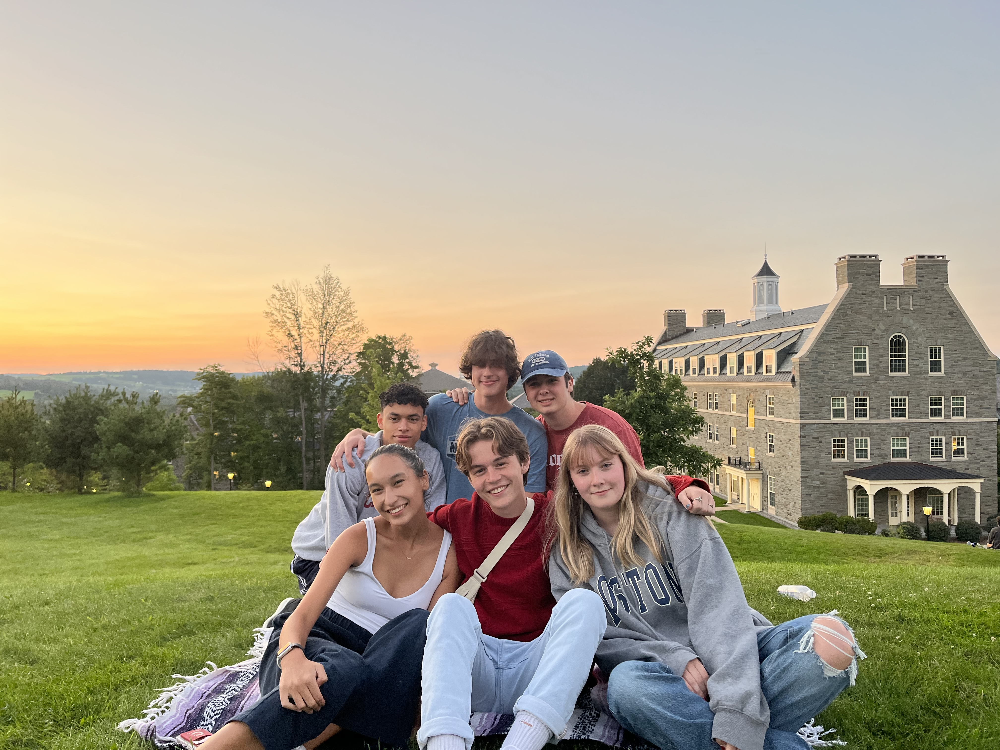
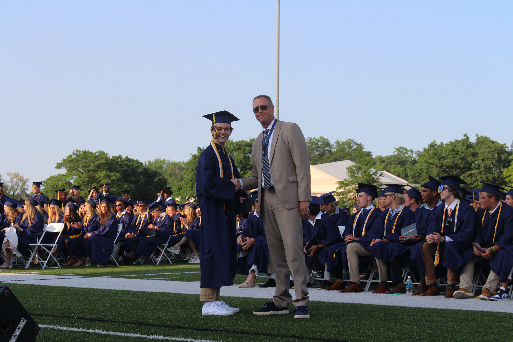
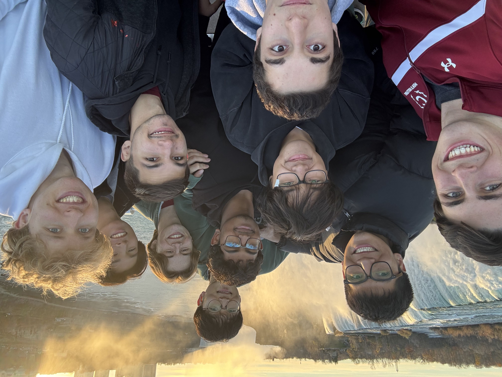
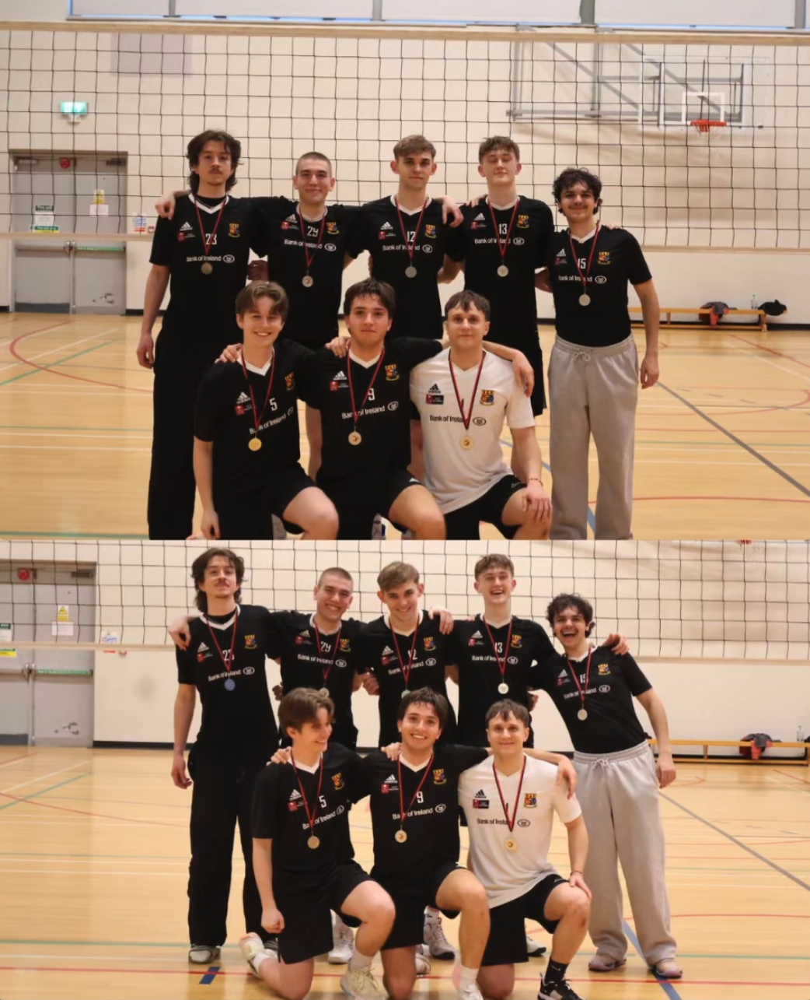
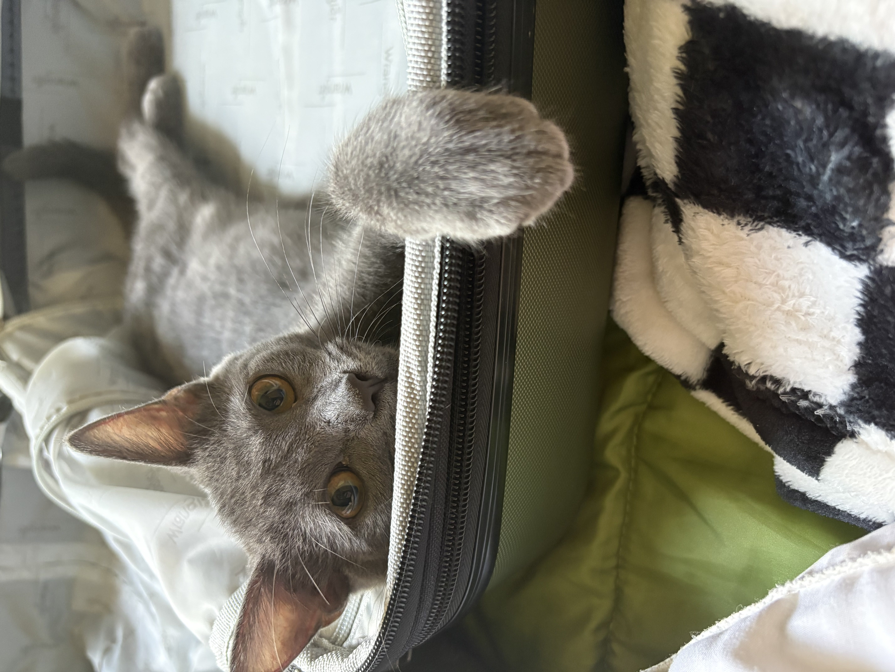

I'm a student at Colgate University studying applied mathematics and biology. My anticipated graduation date is May 2027. I plan on applying for PhD programs in biostatistics, statistics, and mathematics to hopefully begin in the fall of 2027. 

I grew up in St. Joseph, MI, a small beachy town just across the lake from Chicago. I always enjoyed math class in school, and after taking AP statistics, I was hooked. I graduated top 5% in my class and with the mathematics department award. 

Outside of school I love to play volleyball, especially beach volleyball. I'm now a captain of the club volleyball team here on campus after playing since freshman year. I also played volleyball while studying abroad at UCC in Cork, Ireland (The real capital). 

I now live in Kalamazoo, MI, home of the broncos of WMU. This is my cat/roommate Jiji (She loves suitcases). 

