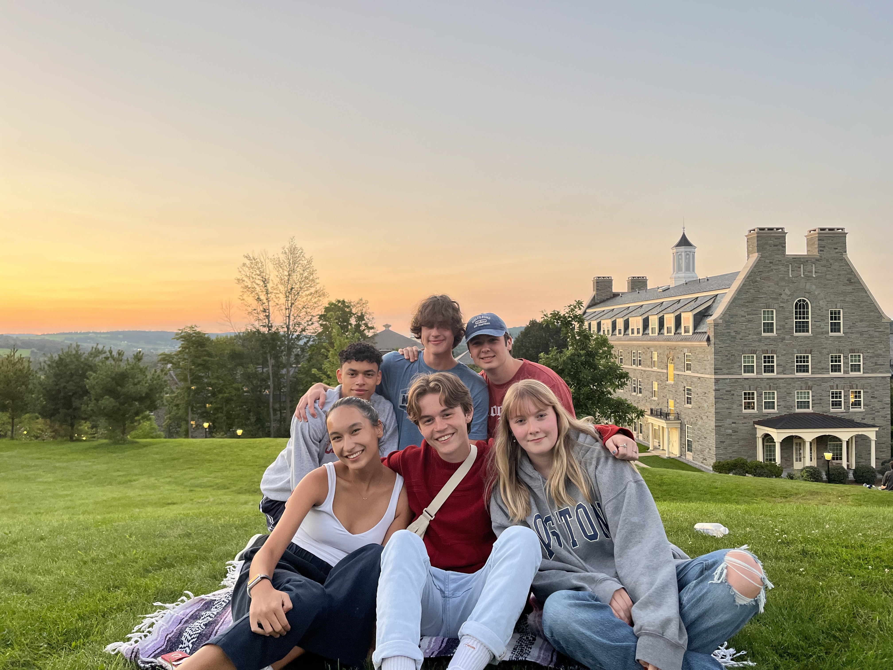
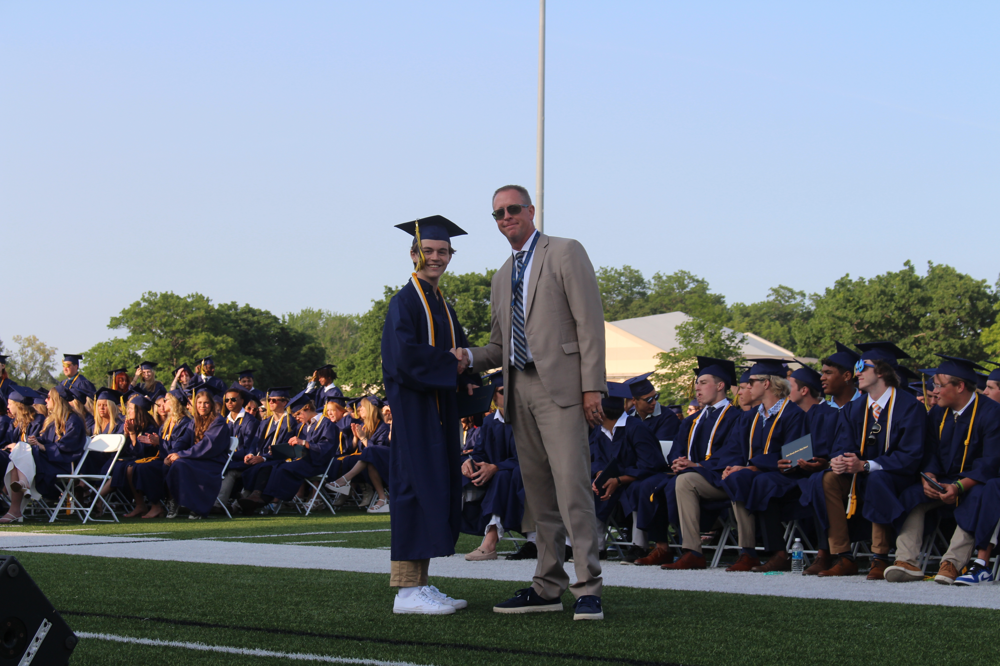
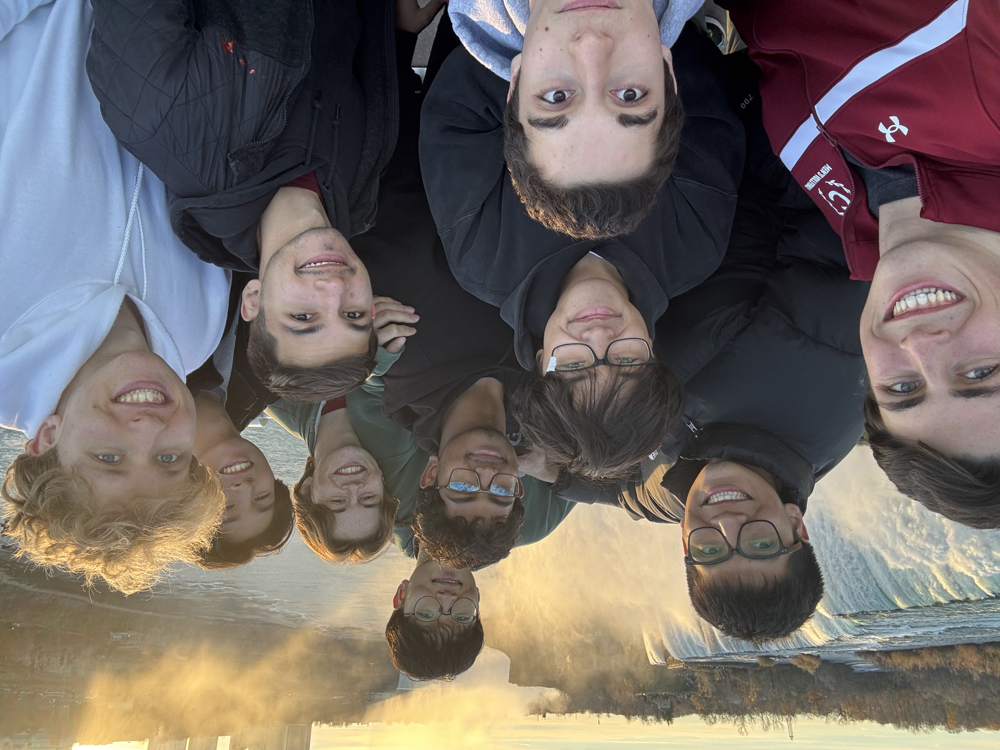
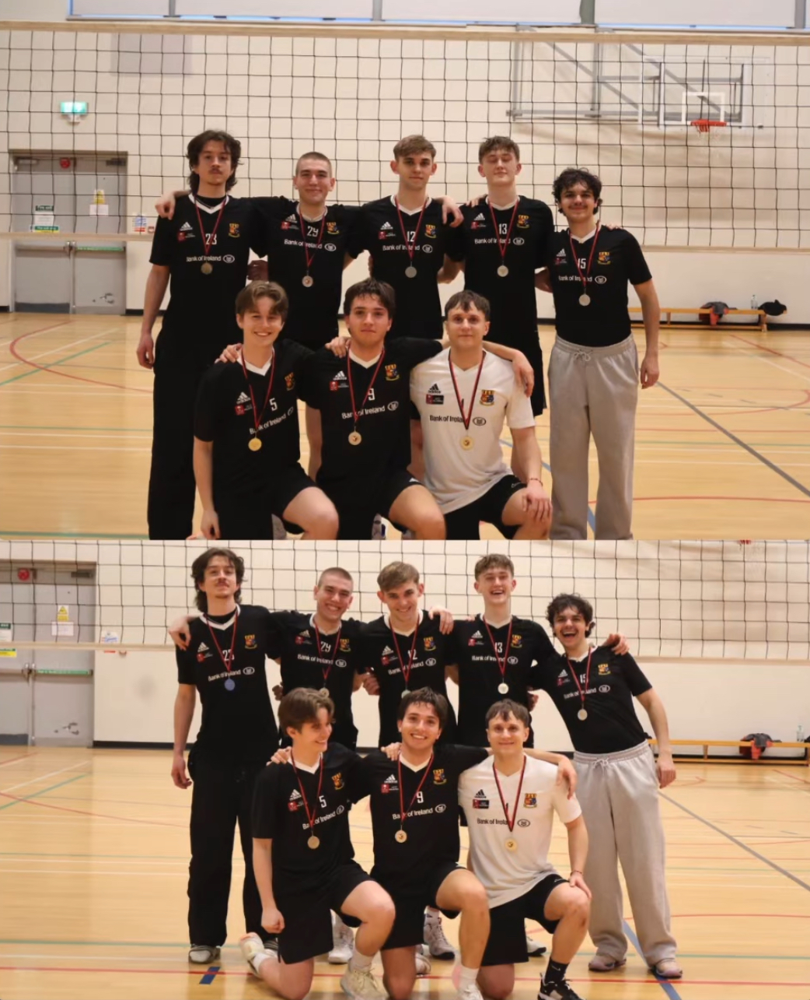
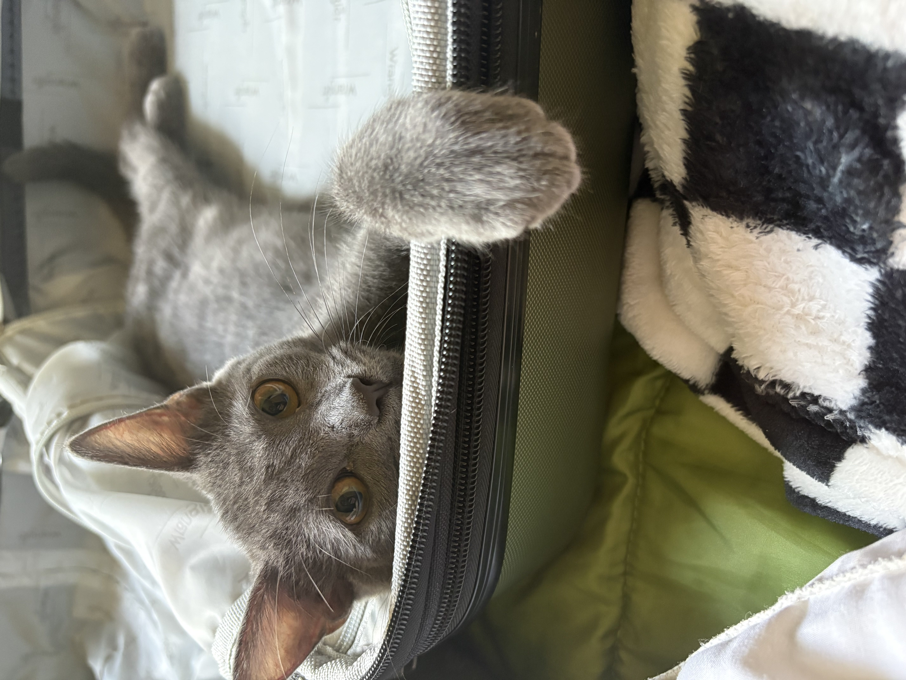

I'm a student at Colgate University studying applied mathematics and biology. My anticipated graduation date is May 2027. I plan on applying for PhD programs in biostatistics, statistics, and mathematics to hopefully begin in the fall of 2027. 

{width=40%}

I grew up in St. Joseph, MI, a small beachy town just across the lake from Chicago. I always enjoyed math class in school, and after taking AP statistics, I was hooked. I graduated top 5% in my class and with the mathematics department award. 

{width=40%}

Outside of school I love to play volleyball, especially beach volleyball. I'm now a captain of the club volleyball team here on campus after playing since freshman year. I also played volleyball while studying abroad at UCC in Cork, Ireland (The real capital). 

{width=40%}
{width=30%}

I now live in Kalamazoo, MI, home of the broncos of WMU. This is my cat/roommate Jiji (She loves suitcases). 

{width=40%}

If you want to see more of what I've done, feel free to click through the menu at the top left of the screen! 

For examples of my work in statistics, check out my [Data Analysis II portfolio!](Data%20Analysis%20II/overview.qmd)

